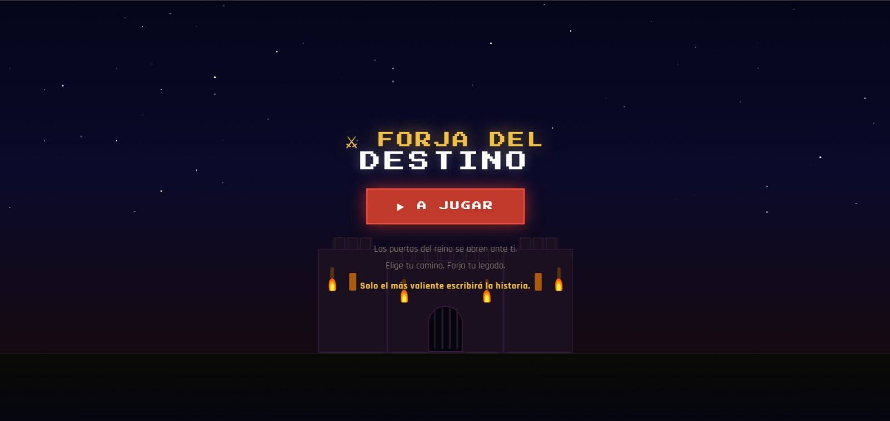
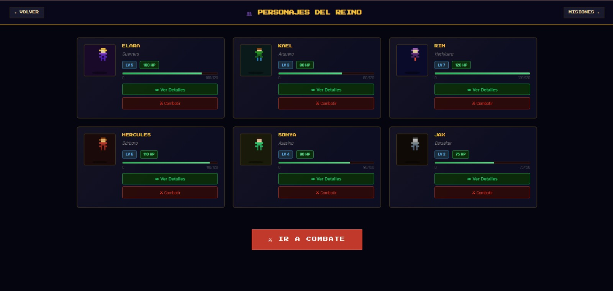
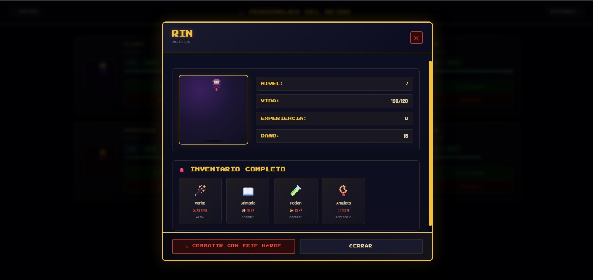
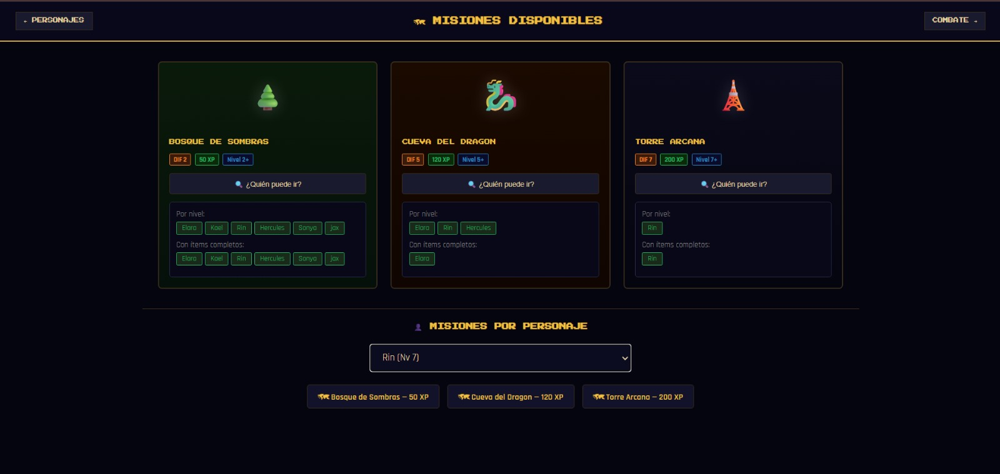
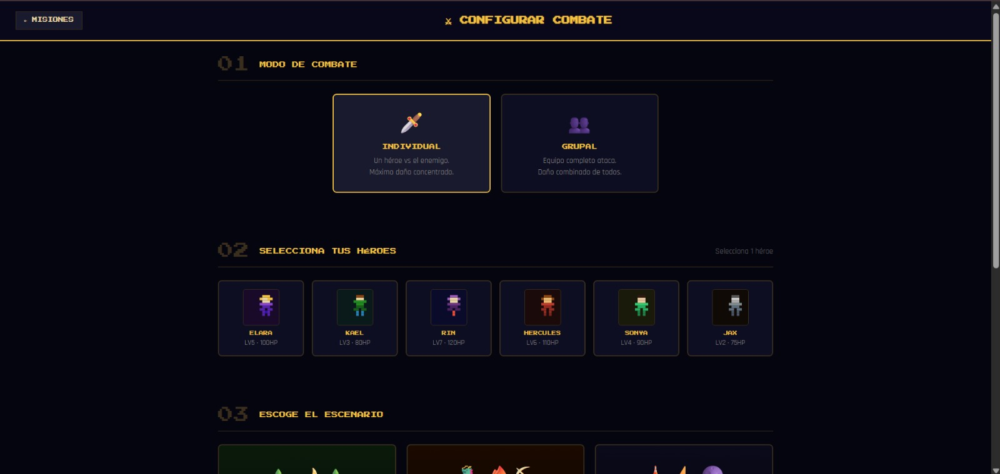
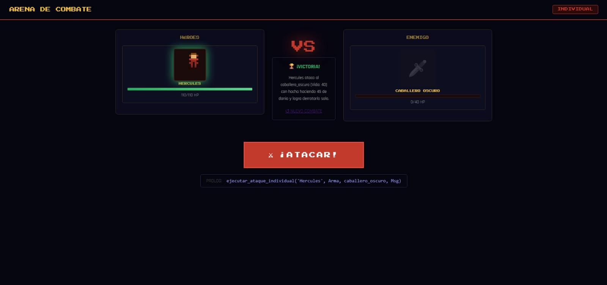
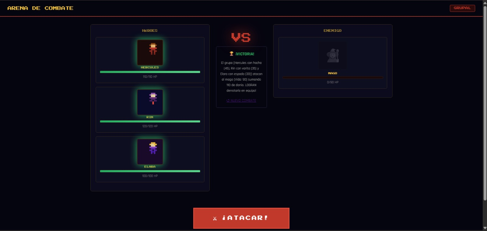

# ⚔ El Reino de los Misterios

Materia: Lenguajes de Programación | Periodo: 2026-1 | Estado: Cursando

## Equipo de trabajo
- [Sebastian Gómez Villafuerte](https://github.com/danielgomez-spec)

## Capturas / Demo

### 1. Pantalla de introducción

> Castillo animado con estrellas y antorchas que da la bienvenida al juego.
> Construido con CSS puro: animaciones de llama, estrellas con opacidad
> aleatoria y efecto de entrada con fade-in.

### 2. Personajes del reino

> Cuadrícula de 6 personajes con nivel, HP, clase y barra de vida.
> Los datos se obtienen desde la base de conocimiento Prolog en tiempo real.

### 3. Inventario inline expandido

> Al pulsar "Ver Inventario", el panel se despliega dentro de la misma carta
> sin salir de la página. Muestra icono, nombre y estadística de cada ítem
> (DMG para armas, DEF para defensas, XP para soportes).
> Renderizado en PHP para garantizar visibilidad sin importar el estado de JS.

### 4. Misiones disponibles

> Lista de misiones con dificultad y XP. El botón "¿Quién puede ir?"
> lanza una consulta Prolog que filtra personajes por nivel y por ítems
> requeridos, mostrando dos listas separadas.

### 5. Configuración de combate

> Selector de modo (Individual / Grupal), héroes, escenario y enemigo.
> En modo Individual solo se puede elegir 1 héroe; en Grupal se pueden
> seleccionar varios. Los HP de cada enemigo vienen de Prolog.

### 6. Arena de combate — Individual

> Combate 1 vs 1. Prolog ejecuta `ejecutar_ataque_individual/4` y
> devuelve el resultado. El botón ¡ATACAR! y el mensaje están centrados.
> Se muestra la consulta Prolog ejecutada en el badge inferior.

### 7. Arena de combate — Grupal

> Combate en equipo. Prolog suma el daño de todos los héroes con
> `procesar_ataque_grupo/3` (recursivo) y determina si logran derrotar
> al enemigo en conjunto.

## Tecnologías
`PHP 8.x` | `Laravel 11` | `SWI-Prolog` | `JavaScript Vanilla` | `CSS3`

## Ejecución

```bash
git clone https://github.com/TU-USUARIO/reino-misterios-prolog.git
cd reino-misterios-prolog
composer install
cp .env.example .env
# Editar .env: configurar DB_* y PROLOG_PATH
php artisan key:generate
php artisan serve
